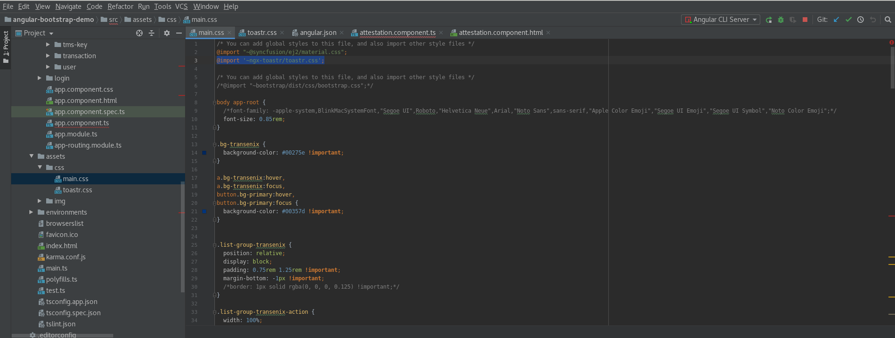
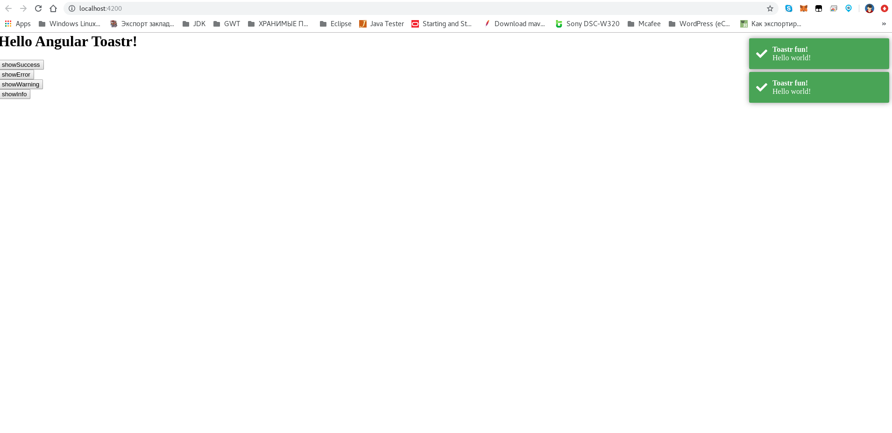

# Angular 7 Toastr Notifications Working Example

An implementation of Angular 7+

* https://stackblitz.com/edit/ngx-toastr-angular2
    * [libraries.io ngx-toastr](https://libraries.io/npm/ngx-toastr)
    * `Angular 7/8 | Adding Toastr Messages in Angular 4+ Web Application in Few Steps`
        * https://www.freakyjolly.com/tag/ngx-toastr-angular-7-6-example/
        * https://www.freakyjolly.com/angular-6-7-adding-toastr-messages-in-angular-4-web-application-in-few-steps/#more-2060
* [Angular Bootstrap alerts](https://mdbootstrap.com/docs/angular/components/alerts/)
* [Here are the few commands to install Angular 8](https://therichpost.com/angular-7-toastr-notifications-working-example/)

Чтобы интегрировать **Toastr** Notifications в проект нужно:
- подключить библиотеку ( _ngx-toastr_ _9.1.1_ )
- и стили в _styles.css_ ( **@import '~ngx-toastr/toastr.css';** )
    - в случае если стили перебиваются можно их принудительно затянуть в проект:
        - https://stackoverflow.com/questions/49194316/override-a-components-default-sass-variables-in-a-different-angular-cli-project
        - https://github.com/scttcper/ngx-toastr
        - скопировать файл-стилей из библиотеки _toastr.css_ в свой проект и подключить его последним в _angular.json_
                

---

* [Self closing alert](https://ng-bootstrap.github.io/#/components/alert/examples)
    * https://yntfa2.run.stackblitz.io
* https://www.c-sharpcorner.com/article/toastr-like-notification-component-in-angular-7/
* https://www.c-sharpcorner.com/article/implement-toastr-notification-in-angular-7/

* https://demo.mobiscroll.com/angular/alerts-notifications/alert
